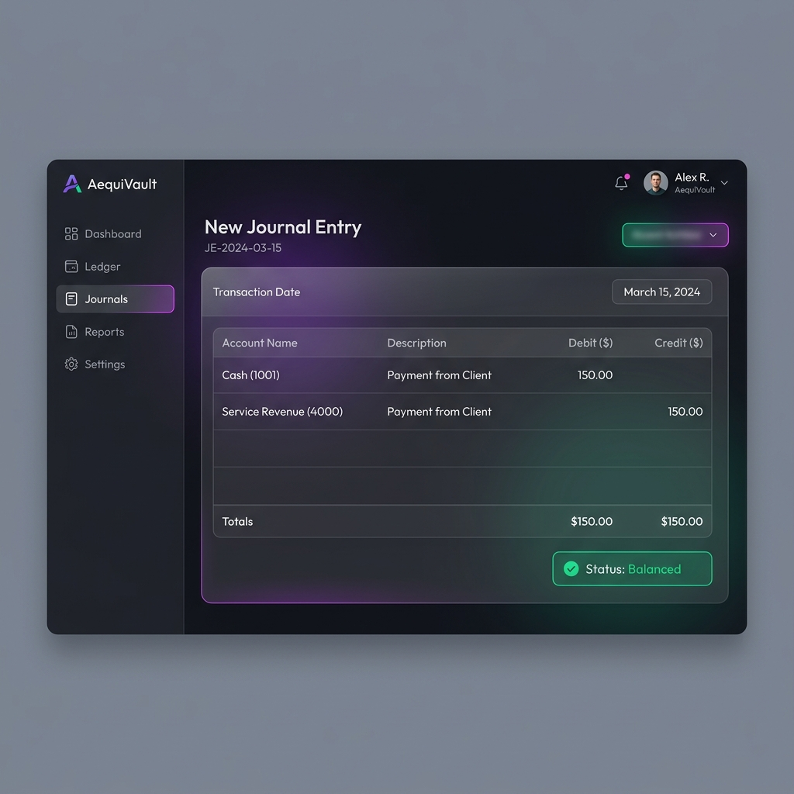
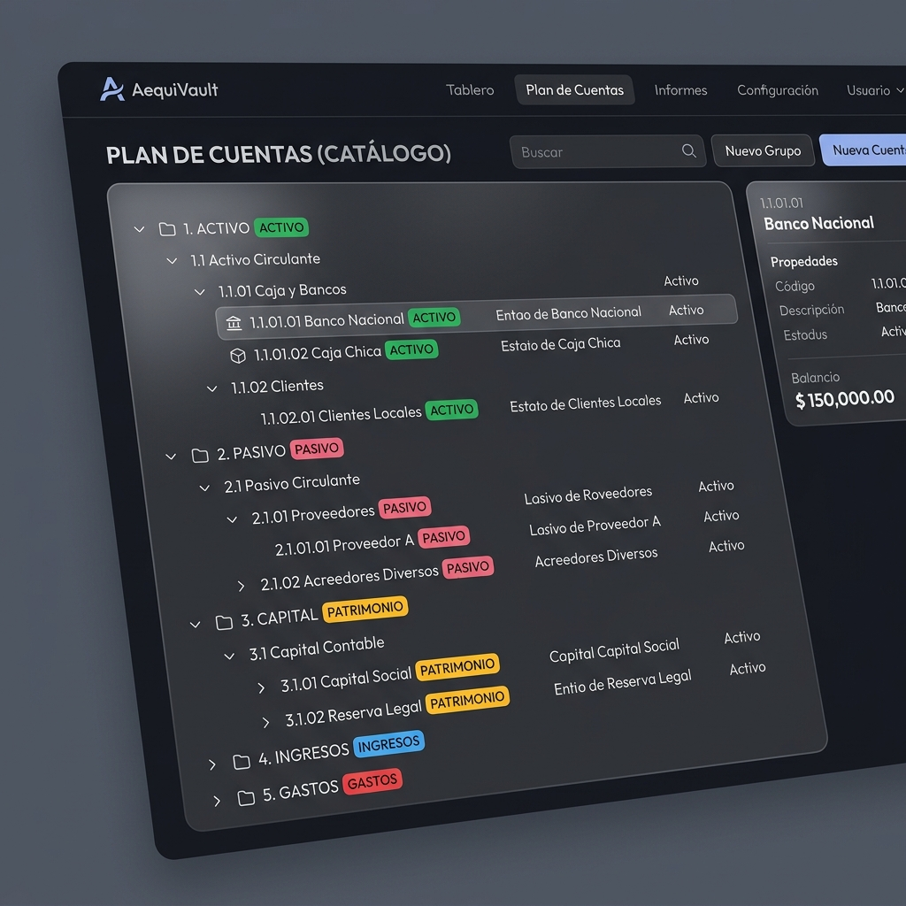

# 🏛️ AequiVault: Motor API-First de Partida Doble

[](https://openjdk.org/)
[](https://spring.io/projects/spring-boot)
[](https://www.postgresql.org/)
[](https://angular.dev/)
[](https://www.liquibase.com/)
[](LICENSE)

**AequiVault** es un motor de contabilidad de partida doble B2B de grado empresarial, diseñado bajo una arquitectura API-first y un modelo *Open Core*. Resuelve la complejidad de integrar lógica financiera e inmutable en plataformas SaaS de manera descentralizada sin recurrir a costosos y lentos sistemas ERP monolíticos. Garantiza que todas las transacciones sean balanceadas y auditables bajo la conformidad SOX, aislando físicamente los datos por inquilino mediante políticas criptográficas en el motor relacional.

---

## 📸 Vista del Proyecto (UI Showcase)

<div align="center">
  <h3>✍️ Registro de Asiento Contable Diario (Hito 2 - Reactivo con Signals)</h3>
  
  
  <br/><br/>
  
  <h3>📊 Plan de Cuentas Jerárquico - COA (Hito 3 - Postgres LTREE y Árbol Recursivo)</h3>
  
</div>

---

## 🏗️ Arquitectura y Decisiones de Diseño (The Flex)

Este proyecto ejemplifica buenas prácticas de ingeniería de software a gran escala y diseño de sistemas distribuidos:

### 🔒 Inmutabilidad en el Dominio (Clean Architecture & CQRS)
*   La partida doble es un invariante sagrado. Los asientos contables definitivos (`POSTED`) no permiten modificaciones (`UPDATES`) ni borrados (`DELETES`). Cualquier corrección financiera requiere un contra-asiento de reversión.
*   El núcleo del negocio está modelado en Java puro sin dependencias de frameworks externos (Clean Architecture).
*   Se implementa un patrón **CQRS Pragmático**: las escrituras validan reglas de negocio complejas en el dominio, mientras que las consultas (Dashboard, Reportes) se realizan sobre proyecciones optimizadas para evitar la presión sobre el Garbage Collector de Java 21.

### 🌳 Catálogo Jerárquico de Alta Velocidad (PostgreSQL `LTREE`)
*   Para evitar costosas consultas recursivas recursivas tipo `WITH RECURSIVE` a nivel SQL, el Plan de Cuentas (COA) se almacena utilizando el tipo nativo **`LTREE`** de PostgreSQL e índices **GiST**. Esto permite consolidar e identificar saldos de ramas enteras en complejidad constante $O(1)$ a nivel de aplicación.

### 📊 Saldo Continuo y Trial Balance ($O(1)$ en JVM)
*   Los reportes del Libro Mayor (General Ledger) con saldo continuo (*Running Balance*) y de Sumas y Saldos (Trial Balance) se delegan en PostgreSQL mediante **funciones de ventana** (`SUM() OVER(...)`) y agregaciones acumulativas. Esto elimina la necesidad de extraer miles de registros a memoria de la JVM, garantizando un rendimiento óptimo de carga constante.

### 🛡️ Aislamiento Criptográfico Multi-Tenant (PostgreSQL RLS)
*   La seguridad lógica multi-inquilino **no** se confía a interceptores de nivel ORM (como Hibernate `@Filter`), los cuales son propensos a fugas de datos involuntarias.
*   En su lugar, el backend descodifica el token **JWT** (generado criptográficamente con JJWT 0.12.6 en el login del usuario) para extraer de manera confiable su `tenantId`.
*   Este ID es propagado al hilo transaccional y se inyecta directamente como una variable de sesión en la conexión JDBC de PostgreSQL. El motor de base de datos aplica políticas nativas de **Row-Level Security (RLS)**, aislando físicamente los datos contables en cada consulta.
*   Toda la gestión transaccional está protegida contra fugas de hilos (`ThreadLocal Leakage`) en el connection pool mediante bloques `try-finally` estrictos.

### 🚀 Patrón First-Time Setup Bootstrapping
*   El sistema cuenta con un flujo seguro de inicialización inicial. Si la base de datos está vacía, el backend bloquea toda la API pública excepto el endpoint de inicialización para crear el primer inquilino administrativo y su usuario `SUPER_ADMIN`. Las inicializaciones duplicadas están bloqueadas y arrojan errores semánticos HTTP 422 de manera determinista.

---

## 🎨 Frontend Moderno (Angular 18)

La interfaz de usuario de AequiVault ha sido diseñada bajo estrictos estándares corporativos de rendimiento y usabilidad:

*   **Signals & Reactividad Síncrona:** El estado local y los desbalances de los formularios contables se gestionan con Signals nativas de Angular 18, reduciendo el abuso de observables asíncronos (RxJS) al mínimo y logrando ciclos de renderizado altamente eficientes.
*   **Standalone Components:** Arquitectura modular de componentes independientes libre de declaraciones pesadas de módulos.
*   **Internacionalización (i18n):** Traducción dinámica en tiempo de ejecución con **Transloco**, cargando los archivos diccionarios JSON de inglés y español de forma diferida (*lazy loading*) para evitar el bloqueo del renderizado inicial.
*   **UI Premium en Modo Oscuro:** Estilizado minimalista premium mediante *Glassmorphism*, bordes suaves, degradados reactivos e interactividad detallada con transiciones sutiles.

---

## 🚀 Guía de Inicio Rápido (Quick Start)

### Prerrequisitos
*   [Docker](https://www.docker.com/) y Docker Compose
*   [Java 21 JDK](https://adoptium.net/)
*   [Node.js v20+](https://nodejs.org/)

### 1. Levantar la Base de Datos (PostgreSQL 16)
Desde la carpeta raíz del proyecto, inicializa el contenedor Docker de PostgreSQL:
```bash
docker compose up -d
```
*(PostgreSQL se iniciará en el puerto local `5433`)*

### 2. Compilar e Iniciar el Backend (Spring Boot)
Navega al directorio de backend, compila y levanta la aplicación:
```bash
cd aequivault/backend
./mvnw clean install
./mvnw spring-boot:run
```
*(El backend se levantará en `http://localhost:8080`. Liquibase ejecutará automáticamente todas las migraciones del esquema y los privilegios RBAC).*

### 3. Iniciar el Frontend (Angular)
Navega a la carpeta de frontend e inicia el servidor de desarrollo:
```bash
cd aequivault/frontend
npm install
npm run start
```
*(El portal B2B estará disponible en `http://localhost:4200`)*

Al ingresar por primera vez, el sistema detectará el estado virgen de la base de datos y redirigirá al Wizard de Inicialización en `/setup` para crear la empresa administrativa inicial.

---

## 📚 Documentación Adicional
1.  [📜 Reglas de Negocio Contables](docs/rules.md)
2.  [🗺️ Plan del Proyecto y Arquitectura](docs/plan_proyecto_senior.md)
3.  [✅ Walkthrough de Implementación de Hitos](docs/walkthrough.md)

---

## ⚖️ Licencia
Este proyecto está distribuido bajo la **[Licencia MIT](LICENSE)**. Siéntete libre de utilizarlo, modificarlo o usarlo como base para tus propias arquitecturas multi-tenant transaccionales.
