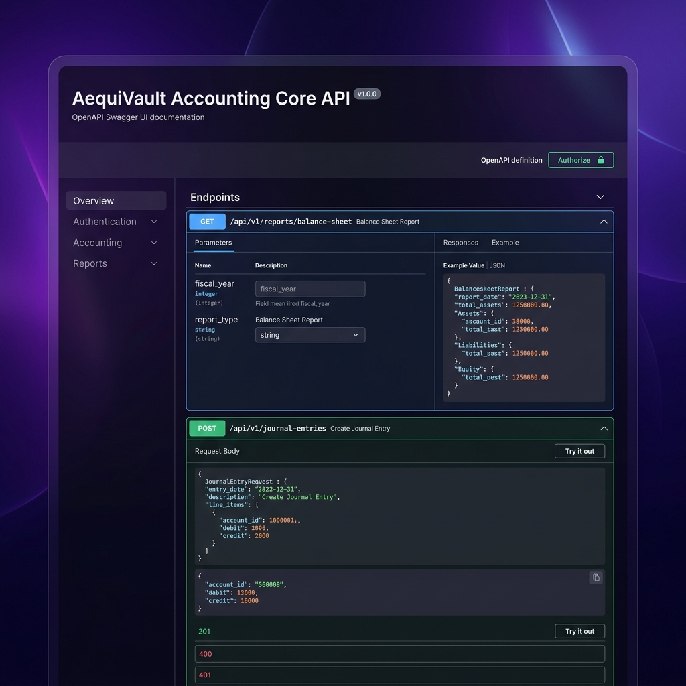

# 🏛️ AequiVault: Motor de Contabilidade de Partida Dobrada API-First

[English](README.md) | [Español](README.es.md) | [Português](README.pt-BR.md)

[](https://openjdk.org/)
[](https://spring.io/projects/spring-boot)
[](https://www.postgresql.org/)
[](https://angular.dev/)
[](https://www.liquibase.com/)
[](LICENSE)

O **AequiVault** é um motor de contabilidade de partida dobrada B2B de classe empresarial projetado sob uma arquitetura API-first e um modelo **Open Core**. Ele resolve a complexidade de integrar lógica financeira imutável em plataformas SaaS modernas de forma descentralizada, sem depender de sistemas ERP caros, lentos e monolíticos. Garante que todas as transações estejam balanceadas e sejam auditáveis sob a conformidade com a lei SOX, enquanto isola fisicamente os dados dos inquilinos (tenants) usando variáveis de sessão criptográficas na camada de banco de dados.

---

## 📸 Demonstração da Interface de Usuário

<div align="center">
  <h3>✍️ Lançamento de Diário (Reativo com Angular 18 Signals)</h3>
  
  
  <br/><br/>
  
  <h3>🌳 Plano de Contas Hierárquico - COA (PostgreSQL LTREE e Árvore Recursiva)</h3>
  

  <br/><br/>
  
  <h3>🛠️ Documentação de API Interativa (Demonstração de OpenAPI / Swagger UI)</h3>
  
</div>

---

## 🏗️ Decisões de Design e Arquitetura

Este projeto exemplifica as melhores práticas em engenharia de software em larga escala e design de sistemas distribuídos:

### 🔒 Imutabilidade do Domínio (Arquitetura Limpa e CQRS)
*   A contabilidade de partida dobrada é um invariante de negócios sagrado. Os lançamentos de diário confirmados (`POSTED`) não permitem modificações (`UPDATES`) ou exclusões (`DELETES`). Qualquer correção financeira deve ser realizada por meio de um lançamento de estorno.
*   O núcleo de negócios é modelado em Java puro sem dependências de frameworks externos (Clean Architecture).
*   Um padrão **CQRS lógico** é implementado: as gravações validam regras de negócios complexas no domínio, enquanto as leituras (Dashboard, Relatórios) são executadas em projeções otimizadas para ignorar a pressão do Garbage Collector da JVM.

### 🌳 Plano de Contas Hierárquico de Alta Velocidade (PostgreSQL `LTREE`)
*   Para evitar consultas recursivas custosas `WITH RECURSIVE` na camada SQL, o Plano de Contas (COA) é armazenado usando o tipo nativo **`LTREE`** do PostgreSQL e indexação **GiST**. Isso permite que o sistema consolide saldos de ramificações inteiras com complexidade constante $O(1)$ no nível da aplicação.

### 📊 Saldos Contínuos e Balancete de Verificação (Memória JVM $O(1)$)
*   Os saldos do Razão e os agregados do Balancete de Verificação são delegados ao PostgreSQL usando **funções de janela** (`SUM() OVER(...)`) e rollups cumulativos. Isso elimina a necessidade de carregar milhares de registros na memória da JVM, garantindo um tempo de execução constante independentemente do tamanho do banco de dados.

### 🛡️ Isolamento Multi-Tenant Criptográfico (PostgreSQL RLS)
*   O isolamento lógico de inquilinos (multi-tenancy) não é confiado a interceptores de nível de ORM (como o Hibernate `@Filter`), que são altamente propensos a vazamentos acidentais de dados.
*   Em vez disso, o backend decodifica o **JWT** (assinado criptograficamente usando JJWT 0.12.6 durante o login do usuário) para extrair o `tenantId`.
*   Esse ID é propagado para a thread transacional e injetado diretamente como uma variável de sessão dentro da conexão JDBC do PostgreSQL. O motor de banco de dados aplica **Row-Level Security (RLS)** nativa, isolando fisicamente os dados contábeis no nível da consulta.
*   Todas as transações do pool de conexões são protegidas contra vazamentos de `ThreadLocal` usando blocos estritos `try-finally`.

### 🚀 Padrão de Inicialização do Sistema (First-Time Setup)
*   O sistema possui um fluxo de inicialização seguro. Se o banco de dados estiver vazio, o backend bloqueia todas as APIs públicas, exceto os endpoints de configuração para criar o primeiro inquilino e seu respectivo usuário `SUPER_ADMIN`. Inicializações duplicadas são bloqueadas e retornam erros HTTP 422 determinísticos.

---

## 🎨 Frontend Moderno (Angular 18)

A interface do usuário do AequiVault é construída sob rígidos padrões corporativos de desempenho e design:

*   **Angular 18 Signals e Reatividade Síncrona:** O estado da interface do usuário local e as diferenças de partida dobrada são calculados usando Signals nativas do Angular 18, reduzindo a sobrecarga assíncrona do RxJS e garantindo ciclos de renderização ideais.
*   **Componentes Standalone:** Arquitetura modular de componentes independentes livres de declarações pesadas de módulos.
*   **Internacionalização (i18n):** Traduções dinâmicas em tempo de execução usando o **Transloco**, carregando dicionários JSON em inglês e espanhol por meio de carregamento lento (lazy loading) para evitar o aumento do tamanho do bundle inicial.
*   **Interface do Usuário Premium com Modo Escuro:** Design minimalista estilo glassmorphic, bordes suaves, gradientes reativos e micro-interações.

---

## 🚀 Guia de Início Rápido

### Pré-requisitos
*   [Docker](https://www.docker.com/) e Docker Compose
*   [Java 21 JDK](https://adoptium.net/)
*   [Node.js v20+](https://nodejs.org/)

### 1. Inicializar o Banco de Dados (PostgreSQL 16)
A partir da pasta raiz do projeto, inicialize o contêiner Docker do PostgreSQL:
```bash
docker compose up -d
```
*(O PostgreSQL será iniciado na porta local `5433`)*

### 2. Compilar e Executar o Backend (Spring Boot)
Navegue até o diretório do backend, compile e execute a aplicação:
```bash
cd aequivault/backend
./mvnw clean install
./mvnw spring-boot:run
```
*(O backend será iniciado em `http://localhost:8080`. O Liquibase executará automaticamente todas as migrações do esquema e configurará os privilégios do RBAC).*

### 3. Iniciar o Frontend (Angular)
Navegue até a pasta do frontend e execute o servidor de desenvolvimento:
```bash
cd aequivault/frontend
npm install
npm run start
```
*(O portal B2B estará disponível em `http://localhost:4200`)*

No primeiro acesso, o sistema detectará o estado em branco do banco de dados e redirecionará você para o assistente de configuração em `/setup` para criar a entidade administrativa inicial.

---

## 🚀 Implantação em Produção (Cloud-Native)

O AequiVault segue a metodologia de aplicações de 12 fatores (**12-Factor App**) para implantações nativas na nuvem. O arquivo de orquestração de produção `docker-compose.prod.yml` é totalmente sem estado, agnóstico de porta e trata o banco de dados como um serviço de suporte externo (backing service).

### Decisões de Design
*   **Serviços de Suporte Externos:** O banco de dados (`db`) está excluído do arquivo Compose. Em produção, você deve usar uma instância de banco de dados gerenciada (ex: AWS RDS, GCP Cloud SQL ou um cluster PostgreSQL dedicado) em vez de executá-lo dentro do Docker Compose.
*   **Agnostismo de Porta:** Nenhuma porta é exposta à máquina host. Em seu lugar, usamos `expose` para declarar portas internas (`80` para o frontend Nginx e `8080` para o backend Spring Boot). Um proxy reverso (ex: Traefik, Nginx Ingress, AWS ALB) deve rotear o tráfego externo para o serviço frontend.
*   **Configuração via Ambiente:** Todas as credenciais do banco de dados e parâmetros de conexão são injetados em tempo de execução via variáveis de ambiente padrão.

### Exemplo de Comando de Implantação

Para iniciar a pilha de produção, forneça os detalhes do serviço de suporte externo como variáveis de ambiente:

```bash
SPRING_DATASOURCE_URL="jdbc:postgresql://seu-servidor-rds:5432/aequivault_db?stringtype=unspecified" \
SPRING_DATASOURCE_USERNAME="aequivault_app" \
SPRING_DATASOURCE_PASSWORD="password_seguro_app" \
SPRING_LIQUIBASE_USER="aequivault_admin" \
SPRING_LIQUIBASE_PASSWORD="password_seguro_admin" \
docker compose -f docker-compose.prod.yml up --build -d
```

---

## 📚 Documentação Adicional
1.  [📜 Regras de Negócios Contábeis](docs/rules.md)
2.  [🗺️ Plano do Projeto e Arquitetura](docs/plan_proyecto_senior.md)
3.  [✅ Guia de Implementação](docs/walkthrough.md)
4.  [🏗️ Registros de Decisão de Arquitetura (ADRs)](docs/adr/adr-001-setup-and-auth.md)

---

## ⚖️ Licença
Distribuído sob a **[Licença MIT](LICENSE)**. Sinta-se livre para usar, modificar ou estender isso como modelo para suas próprias arquiteturas transacionais multi-tenant.
