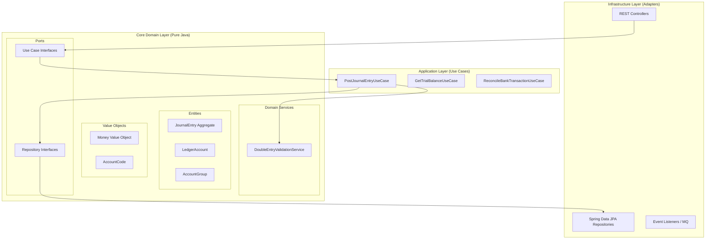

# AequiVault: Enterprise-Grade Double-Entry Accounting Engine
## Senior-Level Open Source Project Plan for Portfolio

Enterprise-grade portfolios require systems that showcase **complex business logic, strict transactional invariants, high-level security, and architectural rigor**. A simple To-Do application or an e-commerce clone does not demonstrate these skills to senior architects and engineering managers.

Taking the core concepts of a general ledger and building a modern, senior-level architecture using **Java 21, Spring Boot 3.x, Angular 18, Clean Architecture (Hexagonal), TDD, and Domain-Driven Design (DDD)** addresses these corporate requirements.

This document defines the complete roadmap and design for this project.

---

## Strategic Product Definition

### 1. Brand Identity & Product Naming
To stand out on GitHub and avoid generic names (e.g., "LedgerApp"), we choose a name rooted in financial concepts:

*   **`AequiVault`** (Chosen Name): A fusion of *Aequi* (from *aequitas*, representing equity, symmetry, and perfect balance in Latin) and *Vault* (representing maximum security and immutability of financial records).
*   **`Librata`**: From the Latin *librare* (to balance), highlighting the double-entry balance sheet equation.
*   **`Vectis`**: Meaning "lever" in Latin, suggesting a financial lever for control.

### 2. The Problem We Solve
B2B SaaS and Fintech developers face a recurring challenge when implementing a general ledger:
*   Integrating enterprise ERPs (e.g., SAP, NetSuite) is expensive, slow, and requires specialized consultants.
*   Building ad-hoc accounting logic from scratch often leads to floating-point rounding errors, double-entry discrepancies, and lack of audit trails.

**AequiVault** acts as the **"Stripe for Accounting"**: an API-first, lightweight, immutable (insert-only), B2B multi-tenant ledger engine that ensures financial books remain mathematically balanced and audit-ready.

### 3. Target Audience
*   **Fintech Startups**: Platforms handling digital wallets, lending, or payment processing that require an immutable, transaction-level internal ledger.
*   **B2B SaaS Creators**: SaaS platforms (invoicing, inventory, HR) looking to embed accounting features without rebuilding the ledger engine.
*   **Software Consulting Firms**: Agencies building custom ERP solutions requiring a robust, financial-grade backend.

### 4. Business Model (Open-Core Monetization)
While the core engine is open-source (MIT licensed), the product is structured with commercial extensions:
1.  **SaaS Managed Cloud**: A hosted version featuring automated daily backups, high availability, and compliance hosting (SOC2).
2.  **Enterprise Support & SLAs**: Integration consultancy and service-level agreements for enterprise deployments.
3.  **Enterprise Add-ons**: Private plugins for local electronic invoicing integrations or bank feeds APIs.

### 5. Value Proposition & Innovation
*   **Headless & API-First**: The backend is entirely decoupled. The Angular UI is a client implementation consuming public REST APIs and Webhooks.
*   **Immutable Ledger Model**: The ledger is strictly **insert-only**. Corrections require reversing journal entries (Contra/Adjustment entries), ensuring bank-grade audit logs.
*   **Draft Staging**: Drafts are kept outside the ledger tables. They reside in staging tables and are moved atomically to the posted ledger only upon formal posting.
*   **Reactivity via Angular Signals**: Real-time browser-side validation calculating debit/credit differences in the frontend dynamically.

### 6. Product Roadmap
The project is structured into four distinct milestones:

```
[Milestone 1: Core Engine & TDD (API)] ──> [Milestone 2: Angular Dashboard & COA]
                 │                                           │
                 v                                           v
[Milestone 3: Multi-tenancy & Advanced] ──> [Milestone 4: Production Deployment & Docs]
```

*   **Milestone 1 (Accounting MVP - Backend)**:
    *   Domain model design and TDD unit tests for double-entry validation.
    *   PostgreSQL database setup and Liquibase migration scripts.
    *   REST API endpoints for Chart of Accounts (COA) CRUD operations and entry posting.
*   **Milestone 2 (UI & Financial Reports)**:
    *   Angular 18 and Tailwind CSS setup.
    *   Interactive journal entry form with real-time balance checks using Signals.
    *   Trial Balance and Balance Sheet reports rendered in-app and exportable.
*   **Milestone 3 (Security & Enterprise Scaling)**:
    *   Logical multi-tenant isolation via database security filters.
    *   Role-Based Access Control (RBAC) via OAuth2/JWT (Admin, Accountant, Auditor).
    *   Fiscal period locking and bank reconciliation engine.
*   **Milestone 4 (SaaS Readiness & Launch)**:
    *   Production multi-stage Docker builds and Docker Compose orchestration.
    *   OpenAPI/Swagger UI documentation.
    *   Architecture documentation and public demo deployment.

---

## 1. Codebase Analysis & Legacy Gotchas

Migrating legacy ledger designs (such as standard MVC structures in PHP/CodeIgniter 3) reveals several critical pitfalls:

1.  **Floating-Point Inaccuracy**: Traditional systems often use floating-point types (`float`, `double`) or rely on dynamic type conversions. Financial calculations must use arbitrary-precision types (`BigDecimal` in Java) and Banker's Rounding to avoid cumulative pennies loss.
2.  **Database Coupling**: Business logic embedded in SQL queries or active-record models binds the application to a specific database syntax and prevents isolated testing.
3.  **COA Performance Bottleneck**: Adjacency lists (`parent_id`) require recursive queries (`WITH RECURSIVE`) to calculate rollups for account branches. Under high transaction volume, these queries bottleneck the database.
4.  **Logical Multi-Tenancy Leakage**: Relying exclusively on application-level filtering (e.g., Hibernate `@Filter` or adding `WHERE tenant_id = x` in every query) introduces security vulnerabilities if a developer forgets to apply the filter.
5.  **Lack of Ledger Immutability**: Allowing direct updates or deletions on posted transactions breaks accounting principles and compromises auditability.

---

## 2. System Vision: **AequiVault**

AequiVault is designed as a secure, high-performance B2B multi-tenant REST API accompanied by a modern, responsive administrative dashboard.

### Core Technology Stack:
*   **Backend**: Java 21, Spring Boot 3.3+, Spring Data JPA, Spring Security (OAuth2/JWT + RBAC), PostgreSQL 16+, Liquibase, ArchUnit.
*   **Frontend**: Angular 18 (Standalone Components, Signals, RxJS, Tailwind CSS, Glassmorphic styling).
*   **DevOps/Infra**: Docker & Docker Compose, GitHub Actions, LocalStack.

---

## 3. Backend Architecture: Hexagonal (Clean Architecture)

We enforce a strict separation of concerns to keep the core business rules completely independent of the framework (Spring Boot) and persistence adapters (PostgreSQL).



### Architectural Tradeoff: Domain Purity vs. Performance (Logical CQRS)

To balance clean architecture with database performance under high transaction volumes:

*   **Command Path (Writes - Pure Hexagonal)**:
    *   *Implementation*: API requests instantiate pure Java domain aggregates (`JournalEntry`, `Money`). These objects are completely decoupled from Spring and JPA. Business rules (double-entry equality, active fiscal periods) are validated within the domain. Upon validation, MapStruct maps the domain model to infrastructure JPA entities (`JournalEntryEntity`, `JournalLineEntity`) for persistence.
    *   *Tradeoff*: Provides high testability via standard JUnit 5 tests running in milliseconds, ensuring domain purity.
*   **Query Path (Reads - Direct Projections)**:
    *   *Implementation*: Reporting and read operations bypass the complex domain mapper model. The query service queries PostgreSQL directly using Spring Data JPA projections into flat DTOs or database-level aggregations.
    *   *Tradeoff*: Eliminates memory mapping overhead, reduces GC pressure, and leverages database indices for rollups, optimizing performance.

---

## 4. Domain Design (DDD) & Accounting Invariants

The domain layer encapsulates business invariants. The following core structures enforce these constraints:

### 1. The `Money` Value Object
To prevent rounding issues, all monetary operations use a dedicated record wrapping `BigDecimal`:

```java
public record Money(BigDecimal amount, Currency currency) {
    private static final int INTERNAL_SCALE = 6;
    
    public Money {
        Objects.requireNonNull(amount);
        Objects.requireNonNull(currency);
    }
    
    public Money add(Money other) {
        checkSameCurrency(other);
        return new Money(this.amount.add(other.amount), currency);
    }
    
    public Money subtract(Money other) {
        checkSameCurrency(other);
        return new Money(this.amount.subtract(other.amount), currency);
    }
    
    public Money roundForStorage() {
        return new Money(this.amount.setScale(4, RoundingMode.HALF_EVEN), currency);
    }
    
    public boolean isZero() { 
        return this.amount.compareTo(BigDecimal.ZERO) == 0; 
    }
    
    private void checkSameCurrency(Money other) {
        if (!this.currency.equals(other.currency)) {
            throw new IllegalArgumentException("Currency mismatch is not allowed in operations");
        }
    }
}
```

### 2. The `JournalEntry` Aggregate
The `JournalEntry` controls the validation and lifecycle of transaction details:
*   **Double-Entry Invariant**: The sum of Debits must equal the sum of Credits.
*   **Ledger Immutability**: Once an entry status is marked as `POSTED`, it cannot be modified or deleted.
*   **Staging Isolation**: Drafts are separated at the database level (`draft_journal_entries`) and are only written to the general ledger when finalized.

```java
public class JournalEntry {
    private final JournalEntryId id;
    private final List<JournalLine> lines;
    private final LocalDate date;
    private EntryStatus status;

    public void post(DoubleEntryValidationService validator) {
        if (status == EntryStatus.POSTED) {
            throw new IllegalStateException("Journal entry is already posted");
        }
        validator.validateBalance(this.lines);
        this.status = EntryStatus.POSTED;
    }
}
```

---

## 5. Database Design & Concurrency Management

We utilize **PostgreSQL** to enforce ACID compliance and optimize hierarchical queries:

```
                  +-------------------+
                  |   AccountGroup    | <----+ Hierarchical index using LTREE
                  +-------------------+
                            | 1
                            |
                            | N
                  +-------------------+
                  |   LedgerAccount   |
                  +-------------------+
                            | 1
                            |
                            | N
+--------------+  |  +-------------------+
| JournalEntry | -|- |    JournalLine    |
+--------------+     +-------------------+
  (Immutable)          (Detail: amount,
                        debit_credit, 
                        reconciliation_date)
```

### Hierarchical Account Consolidation via PostgreSQL `LTREE`
*   **Problem**: Querying adjacency lists (`parent_id`) recursively in Java or SQL creates database bottlenecks.
*   **Solution**: We use the native PostgreSQL **`LTREE`** extension. The structure path is stored as dot-separated labels (e.g., `1`, `1.1`, `1.1.1`).
*   **Performance**: Calculating balances for a parent node (e.g., "Assets" with path `1`) uses the path descendant operator (`<@`) backed by a **GiST** index:
    ```sql
    SELECT SUM(jl.amount) 
    FROM journal_lines jl
    JOIN ledger_accounts la ON jl.ledger_id = la.id
    JOIN account_groups ag ON la.group_id = ag.id
    WHERE ag.path <@ '1';
    ```

### Concurrency and Locking
*   **Ledger Invariance**: The general ledger is strictly **insert-only**. No update queries are performed on `journal_lines` or `journal_entries` once posted.
*   **Balance Queries**: Balances are calculated dynamically using indices. We do not store mutable, pre-aggregated running balances in the `ledger_accounts` table to avoid write bottlenecks from lock contention.
*   **Bank Reconciliation**: For reconciliation operations, pessimistic locks (`SELECT FOR UPDATE`) are applied only to the specific reconciliation records.

### Multi-Tenant Isolation via Row-Level Security (RLS)
To secure tenant isolation:
1.  Enable RLS on all transactional tables:
    ```sql
    ALTER TABLE journal_entries ENABLE ROW LEVEL SECURITY;
    CREATE POLICY tenant_isolation ON journal_entries
    FOR ALL USING (tenant_id = NULLIF(current_setting('app.current_tenant', true), '')::uuid);
    ```
2.  The Spring Boot backend extracts `tenant_id` from the authenticated JWT and sets it locally on the connection session before executing queries:
    ```sql
    SET LOCAL app.current_tenant = :tenantId;
    ```
    This physically confines all query results to the current tenant at the database level. Strict `try-finally` blocks ensure the session variable is cleared after transaction execution, preventing connection pool leaks.

---

## 6. Testing Strategy

We enforce a comprehensive testing pyramid to guarantee system reliability:

1.  **Domain Unit Testing (TDD)**:
    *   Tests run without booting Spring Boot or database containers.
    *   Validates that unbalanced entries (e.g., Debits: $100.00, Credits: $99.99) fail instantly.
2.  **Database Integration Testing (Testcontainers)**:
    *   Integration tests run against a real, containerized PostgreSQL database.
    *   Verifies that transactional RLS and `LTREE` queries function correctly.
3.  **Architectural Rules (ArchUnit)**:
    *   Validates that domain packages do not import infrastructure or framework classes:
    ```java
    @Test
    void domainShouldNotDependOnInfrastructure() {
        classes().that().resideInAPackage("..domain..")
            .should().onlyDependOnClassesThat().resideInAnyPackage("..domain..", "java..")
            .check(importedClasses);
    }
    ```

---

## 7. Frontend Architecture (Angular 18)

The frontend is designed as a responsive, standalone dashboard:

```
src/app/
 ├── core/              # Guards, Interceptors, Global Services (Auth, API)
 ├── shared/            # Reusable UI Components (Buttons, Glassmorphic Cards)
 └── features/
      ├── dashboard/    # Metrics and charts
      ├── accounts/     # Hierarchical Chart of Accounts
      ├── journal/      # Journal entry form (Reactivity via Signals)
      └── reports/      # Financial reports viewer (Trial Balance, Balance Sheet)
```

*   **Smart & Dumb Component Pattern**: Separation of data fetching components (Smart) from UI rendering components (Dumb).
*   **Signals Reactive Core**: Real-time validation of debit and credit balancing on the client-side via Angular Signals.

---

## 8. Detailed Technical & Design Specifications

### 8.1. Information Architecture (Site Map)
```
[Public Portal]
 ├── /login (User Access)
 └── /onboarding (Initial Tenant Setup Wizard)

[Authenticated Workspace] (Requires Valid JWT and TenantID)
 ├── /dashboard (Financial metrics, liquidity trends)
 ├── /coa (Hierarchical Chart of Accounts Tree)
 ├── /journal (General Journal ledger list & entry creation)
 ├── /reconciliation (Bank reconciliation panel)
 └── /reports (Financial reporting engine)
```

---

### 8.2. Critical User Journeys

#### Route 1: Posting a Journal Entry
1.  The accountant navigates to "/journal/new".
2.  The UI renders the entry form. The accountant inputs the transaction date and metadata.
3.  The accountant adds line items. Adding a debit line updates the `debitSum` signal.
4.  Adding a balancing credit line updates `creditSum`. Once `debitSum == creditSum`, the `isBalanced` signal becomes `true`, enabling the submit button.
5.  On submission, the API processes the entry in an atomic database transaction.

#### Route 2: Bank Reconciliation
1.  The accountant uploads a bank statement CSV/OFX.
2.  The UI displays a split-screen layout: bank transactions on the left, ledger entries on the right.
3.  The backend suggests matches based on transaction amount and date.
4.  The accountant confirms the matches, updating `reconciliation_date` under a pessimistic write lock.

---

### 8.3. Database Schema

#### `tenants`
| Column | Type | Constraints |
| :--- | :--- | :--- |
| `id` | UUID | PRIMARY KEY |
| `name` | VARCHAR(255) | NOT NULL |
| `created_at` | TIMESTAMP | NOT NULL |

#### `account_groups`
| Column | Type | Constraints |
| :--- | :--- | :--- |
| `id` | BIGINT | PRIMARY KEY, AUTO_INCREMENT |
| `tenant_id` | UUID | FOREIGN KEY -> `tenants(id)`, NOT NULL |
| `path` | LTREE | NOT NULL |
| `name` | VARCHAR(255) | NOT NULL |
| `code` | VARCHAR(50) | NOT NULL |

#### `ledger_accounts`
| Column | Type | Constraints |
| :--- | :--- | :--- |
| `id` | BIGINT | PRIMARY KEY, AUTO_INCREMENT |
| `tenant_id` | UUID | FOREIGN KEY -> `tenants(id)`, NOT NULL |
| `group_id` | BIGINT | FOREIGN KEY -> `account_groups(id)`, NOT NULL |
| `name` | VARCHAR(255) | NOT NULL |
| `code` | VARCHAR(50) | NOT NULL |

#### `journal_entries`
| Column | Type | Constraints |
| :--- | :--- | :--- |
| `id` | BIGINT | PRIMARY KEY |
| `tenant_id` | UUID | FOREIGN KEY -> `tenants(id)`, NOT NULL |
| `entry_type` | VARCHAR(20) | CHECK (RECEIPT, PAYMENT, JOURNAL) |
| `number` | BIGINT | NOT NULL |
| `date` | DATE | NOT NULL |
| `dr_total` | DECIMAL(25, 4) | NOT NULL |
| `cr_total` | DECIMAL(25, 4) | NOT NULL |

#### `journal_lines`
| Column | Type | Constraints |
| :--- | :--- | :--- |
| `id` | BIGINT | PRIMARY KEY |
| `entry_id` | BIGINT | FOREIGN KEY -> `journal_entries(id)`, NOT NULL |
| `ledger_id` | BIGINT | FOREIGN KEY -> `ledger_accounts(id)`, NOT NULL |
| `amount` | DECIMAL(25, 4) | NOT NULL |
| `dc` | CHAR(1) | CHECK (dc IN ('D', 'C')) |
| `reconciliation_date`| DATE | NULL |

---

### 8.4. REST API Surface

| Method | Endpoint | Payload | Response | Description |
| :--- | :--- | :--- | :--- | :--- |
| `POST` | `/api/v1/auth/login` | `{username, password}` | `{token}` | Authenticates and returns JWT. |
| `GET` | `/api/v1/accounts/coa` | - | `List<GroupDto>` | Returns hierarchical COA structure. |
| `POST` | `/api/v1/entries` | `JournalEntryRequest` | `JournalEntryDto` | Validates and posts double-entry. |
| `GET` | `/api/v1/reports/balance-sheet`| `date` | `BalanceSheetDto` | Generates consolidated Balance Sheet. |
| `GET` | `/api/v1/reports/profit-and-loss` | `startDate, endDate`| `ProfitAndLossDto` | Generates P&L report. |

---

### 8.5. UI Component Catalog

*   **Atomic Components (Dumb)**:
    *   `BtnComponent`: Interactive action button.
    *   `InputTextComponent`: Standard text form field.
    *   `InputAmountComponent`: Numeric field formatting currency to 4 decimal places.
    *   `SelectAccountComponent`: Account search dropdown.
    *   `DatePickerComponent`: Date picker field.
*   **Molecular Components (Smart)**:
    *   `CoaTreeNodeComponent`: Recursive folder node displaying account hierarchy.
    *   `JournalLineRowComponent`: Dynamic row within the journal entry grid.
    *   `BalanceIndicatorComponent`: Color-coded banner indicating balance difference.
    *   `ReportGridComponent`: Indented financial statement table with drill-down views.

---

### 8.6. Performance Targets & Web Vitals

*   **Interaction to Next Paint (INP)**: `< 100ms` (Adding lines, tree navigation).
*   **Largest Contentful Paint (LCP)**: `< 1.5s` (Dashboard loading).
*   **Journal Entry Posting API Response**: `< 200ms` (Double-entry checking + writing).
*   **Balance Sheet Query Execution**: `< 400ms` (LTREE rollup query).

---

### 8.7. Deployment Strategy

The application conforms to **12-Factor App** specifications:
*   **Stateless Backends**: Session data is fully delegated to cryptographically verified JWT tokens.
*   **External Backing Services**: Database instances are kept external in production (e.g. AWS RDS).
*   **Port Agnosticism**: Internal containers expose ports `80` and `8080` internally, delegating public SSL termination and port routing to external Ingress controllers.
*   **CI/CD Pipeline**: GitHub Actions executes testing, compiles the binaries, builds multi-stage Docker images, and triggers deployments.

---

## 9. Execution Plan

1.  **Fase 1: Initialization**: Setup project workspaces, PostgreSQL Docker configuration, and baseline CI actions.
2.  **Fase 2: Domain Development**: Implement domain value objects (`Money`), aggregates (`JournalEntry`), and TDD verification.
3.  **Fase 3: Persistence Integration**: Configure Liquibase migrations, setup Spring Data JPA repositories, and write integration tests with Testcontainers.
4.  **Fase 4: Frontend Development**: Build the Angular dashboard skeleton, COA recursive tree component, and journal entry form.
5.  **Fase 5: Advanced Reports**: Implement PostgreSQL `LTREE` rollups for the Balance Sheet and P&L endpoints. Integrate bank statement parsing.
6.  **Fase 6: Documentation and Final Polish**: Configure Swagger UI, format documentation, and deploy the demo.

---

## 10. Enterprise-Grade Modules

For full enterprise scaling, the system incorporates:
1.  **Fiscal Lock System**: Restricts edits to closed fiscal years.
2.  **Audit Logs**: Tracks user logins, posting events, and system errors in an immutable table.
3.  **Bank Statement Auto-Matching**: Uses heuristics to automatically reconcile ledger entries against imported bank transactions.
4.  **Row-Level Security**: Isolates data security at the database engine level.

---

## 11. Conclusion
AequiVault is a production-ready, transactional B2B accounting engine demonstrating advanced software design patterns, Clean Architecture implementation, and secure database isolation.
